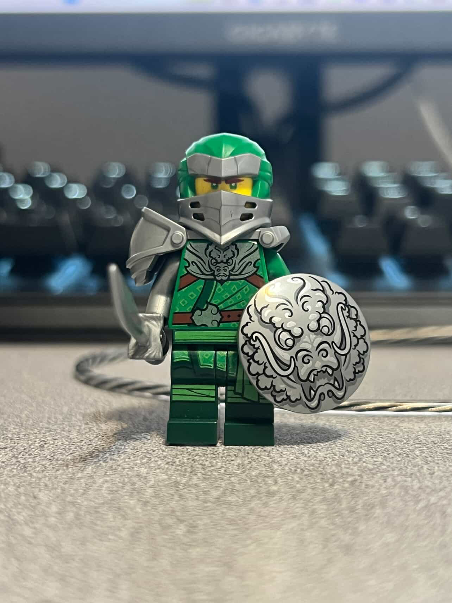

# MMED-1054 Homework 1 Assignment
This is Homework 1 in our Media Authoring Class. We are a creating repo, and collaborating with teams to create About Me pages about each other in branches.

# Le, Phan Binh An

### Age

- I am 21 years old.

### Background 

- I am Vietnamese. I was born and raised in Vietnam. I moved here to Canada by myself.

### Hobbies & Sports :baskettball:

- Customize Lego Figures.
- My favourite sport is basketball cause that is the sport I picked up after my football/soccer injury in secondary school. 

### Pets :cat:

I have a cat back in Vietnam that I rescued from the street in 2023. His name is Miu and he's a Tabby Cat :3 

### Interests 

- NBA
- Premier League
- E-Sports
- New Anime
- Kamen Rider
- Super Sentai

### Music 

I like K-Pop, Hip Hop, and some V-Pop. Sometimes just something trendy. 

### Future Aspirations 

- I want to have jobs that can support my family wherever and whenever I can. This is because it is my duty as a Vietnamese after I graduate. 

- Any job that can give me those opportunities would be fine because that is my goal.

## Installation

## Usage

## Contributing

## History

## Credits 
Gabrielle Young, Le, Phan Binh An, Keisha Esta

## License
MIT License