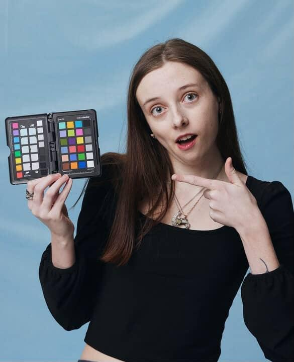

# MMED-1054 Homework 1 Assignment
This is Homework 1 in our Media Authoring Class. We are a creating repo, and collaborating with teams to create About Me pages about each other in branches.

# Le, Phan Binh An

### Age

- I am 21 years old. :two::one:

### Background :vietnam:

- I am Vietnamese. I was born and raised in Vietnam. I moved here to Canada by myself.

### Hobbies & Sports :basketball:

- Customize Lego Figures.
- My favourite sport is basketball cause that is the sport I picked up after my football/soccer injury in secondary school. 

### Pets :cat:

I have a cat back in Vietnam that I rescued from the street in 2023. His name is Miu and he's a Tabby Cat :3 

### Interests 

- NBA
- Premier League
- E-Sports
- New Anime
- Kamen Rider
- Super Sentai

### Music :musical_note:

I like K-Pop, Hip Hop, and some V-Pop. Sometimes just something trendy. 

### Future Aspirations 

- I want to have jobs that can support my family wherever and whenever I can. This is because it is my duty as a Vietnamese after I graduate. 

- Any job that can give me those opportunities would be fine because that is my goal.

## Installation

## Usage

## Contributing

## History

## Credits 
Gabrielle Young, Le, Phan Binh An, Keisha Esta

## License
MIT License
=======
# MMED-1054 the Homework 1 Assignment

This is Homework 1 in our Media Authoring Class. I been added to this repo to struggle in the about me pages.

# Keisha Esta

## Background
My name is Keisha Esta and I am 19 years old this year.
I am a Filipina. I was born in the Philippines but was mostly raised in Saudi Arabia for most of my life. My family and I came to Canada for almost four years now (2022).

### Hobbies & Sports
- I do digital and traditional art. I am a self-taught artist; mostly draw Semi-Realism and Multimedia.
- My favourite sport is Badminton but I also like to play Volleyball.
- Watching videos on YouTube and TikTok

#### Pets
Thave a white maltese dog and her name is Choco, she was named that because her fur was brown when Choco was a puppy. She is 5 years old.
Interests
- Read Manga (Isekai/Reincarnation, Manhwa, Webtoon, Action,

##### Martial Arts)
- Bungou Stray Dogs
- Demon Slayer
- Windbreaker
- Watching YouTubers like Kubzscouts and SmiiZy

###### Where Would I Like To Travel To
- Japan
- Korea
- Australia

###### Fears & Dislikes
- Spiders
- Cockroaches
- A bit of Trypophobia (Fear of Holes in things that shouldn't have holes)

###### Future Aspirations
- I want to get a good job to support myself and live comfortably. I would also like to travel around and meet different people.
- I want to volunteer or get a job at an animal shelter so that I get to

# Gabrielle Young

### Age

- I will be turning 23 at the end of October.

### Background

- I am Irish on both sides of my family and German on my mom's side, but I wasborn in Canada.

### Pets

- I own a cute little tuxedo cat named Lilypad.

### Hobbies

- Reading
- Photography
- Watching Anime or True Crime
- Musicals

### Favourite TV Shows

- Dr. Stone
- Law and Order
- Attack on Titan
- One Piece

### Where would I travel to?

- Japan
- Italy

### Biggest Fear

- Snakes. They are terrifying and creepy.

### Future Aspirations

- I hope to merge web design and my photography skills, to create websites and portfolios for businesses.